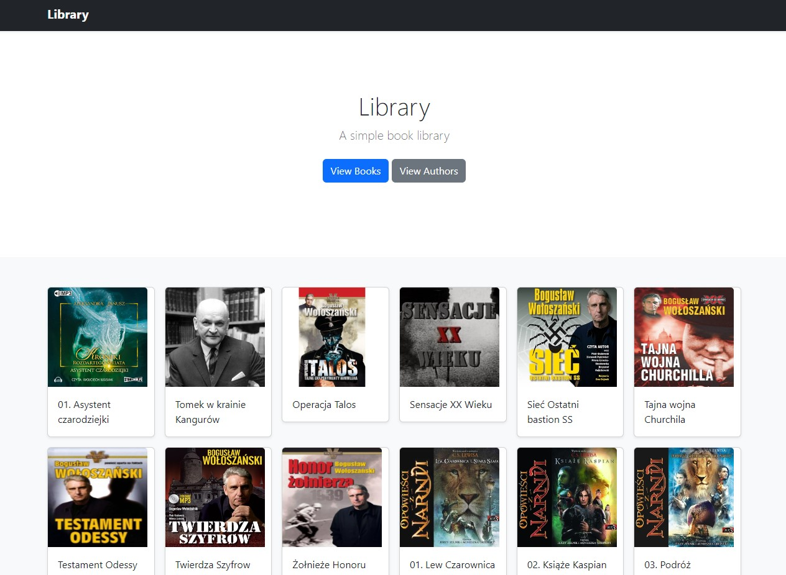

# Audio-lib

|   |   |
| :--- | :---: |
|Audio-lib is a Rust application designed to simplify the management and organization of your audiobook collection. This tool scans your library of audiobooks and generates an interactive HTML view, making it easy to visualize and access your audiobook collection. Whether you have a diverse assortment of standalone titles or a series of books from various authors, this app provides a user-friendly way to navigate through your collection.|  |


## Features

**Library Scanning**: The application recursively scans the specified directory for audiobooks in the supported formats (.mp3) and their associated cover images in formats (.jpg, .jpeg, .png).

**HTML Generation**: After scanning, the app generates an HTML view that displays the audiobooks in an organized and visually appealing format. The view includes book covers, author and series information (if available), and clickable links to play the audiobooks.

## File Structure

The app expects the following file structure for your audiobook library:

```php
Library/
├── <Author Name>
│   ├── <Series Name>
│   │   └── <Book Name>
│   │       ├── book.mp3
│   │       └── cover.<ext> (jpg/jpeg/png)
│   └── <Book Name>
│       ├── book.mp3
│       └── cover.<ext> (jpg/jpeg/png)
├── <Author Name>
│   ├── <Book Name>
│   │   ├── book.mp3
│   │   └── cover.<ext> (jpg/jpeg/png)
└── ...
```

## Building from source

### Linux

```sh
cargo build --release
```

### Windows

```sh
cargo build --target x86_64-pc-windows-gnu --release
```

## Usage

### Linux

```sh
./target/release/audio-lib <path-to-library>
```

### Windows

```sh
.\target\release\audio-lib.exe <path-to-library>
```

## TODO

- [ ] Add support for `.png` and `.jpeg`
- [ ] Add os recognition to make path correct
- [ ] Adjust templates
- [ ] Add metadata support
- [ ] Add more options like (not save json)
- [ ] Add tests
- [ ] Add counter to json
- [ ] Adjust json structure
- [ ] Add possibility to chose output path

## License
This project is licensed under the MIT License.
