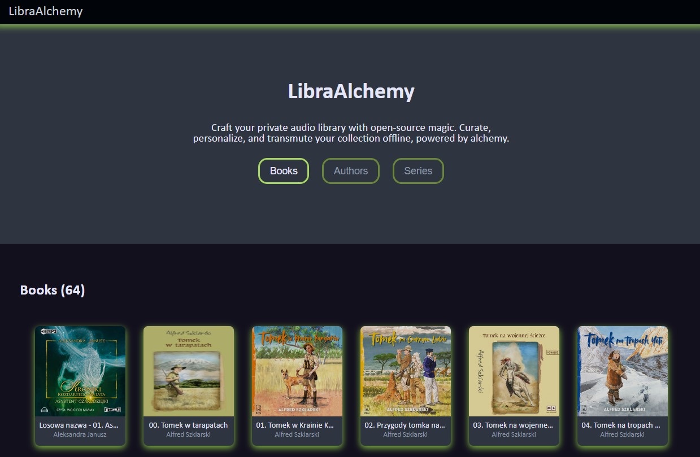

# LibraAlchemy

 

**LibraAlchemy** is a Rust application designed to simplify the management and organization of your audiobook collection. This tool scans your library of audiobooks and generates an interactive HTML view, making it easy to visualize and access your audiobook collection. Whether you have a diverse assortment of standalone titles or a series of books from various authors, this app provides a user-friendly way to navigate through your collection.

## Features

**Library Scanning**: The application recursively scans the specified directory for audiobooks in the supported formats (.mp3) and their associated cover images in formats (check [src/scanner.rc](https://github.com/Azalurg/LibraAlchemy/master/src/scanner.rs) line 8).

**Rocket Server**: After scan, the app runs Rocket server that serves views form predefined templates, filling them with books data form your library. The views include list of all books, authors and series, as well as detail page for each of them.

## File Structure

The app expects the following file structure for your audiobook library:

```php
Library/
├── <Author Name>
│   ├── <Series Name>
│   │   └── <Book Name>
│   │       ├── book.mp3
│   │       └── cover.<ext> (jpg/jpeg/png)
│   └── <Book Name>
│       ├── book.mp3
│       └── cover.<ext> (jpg/jpeg/png)
├── <Author Name>
│   ├── <Book Name>
│   │   ├── book.mp3
│   │   └── cover.<ext> (jpg/jpeg/png)
└── ...
```

## Building from source

### Linux

```bash
cargo build --release
```

### Windows

```bash
cargo build --target x86_64-pc-windows-gnu --release
```

## Usage

### Available args

| arg | type | default value | description |
| :-: | :---: | :----------: | :---------: |
| -w, --work-dir | string | . | specify where your library is located |
| -o, --output-dir | string | . | specify where your database should be saved |
| -s, --save-json | bool | false | if active, saves your database to `output-dir` |
| -f, -force_scan | bool | false | if active, scan your library even if database is present |

### Examples

```bash
./libra_alchemy --work-dir /path/to/library --output-dir /path/to/save/db -s -f
```

## TODO - Rust

- [ ] Fix releases
- [ ] Add function to generate output
- [ ] Add os recognition to make path correct
- [ ] Add metadata support
- [X] Add more options like (not save json, use old json, etc.)
- [ ] Add tests
- [ ] Open html in browser after generation

## TODO - HTML

- [X] Set color palette
- [X] Switch for dark mode
- [ ] Create logo / graphic
- [X] Add footer
- [ ] Add pagination

## License

This project is licensed under the MIT License.
